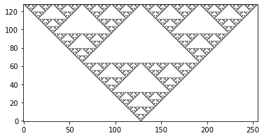

# 提出課題2

!!!note
    - 締め切りや提出方法・提出先については指示を出すのでそれに従ってください。
    - 提出する際には全ての課題解答を単一のJupyter Notebookファイル `kadai2.ipynb` の別々のセルに入力して提出してください。Codespaceの `python` ディレクトリに `kadai2.ipynb` の提出ひな型がある（または[GitHub](https://github.com/chibutsu-utokyo/debian/blob/main/python/kadai2.ipynb) から直接ダウンロードできる）ので、それを使っても構いません。
    - 必ず提出する前にカーネルの再起動を行った後に、全てのセルを実行して結果を確認してください。
    - [テキスト](https://utokyo-ipp.github.io/)の2-2、3-1、3-3、5-3を適宜参照してください。

!!!tip
    numpyやmatplotlibを使う課題があるので、先頭のセルで
    ```python
    import numpy as np
    from matplotlib import pyplot as plt
    ```
    のように必要なモジュールをインポートしてください。

## 課題2-1
tupleの便利な使い方として関数の引数の扱いが挙げられる。
```python
>>> def f(*args):
...     print(args) # 全ての引数を出力
```
のように引数に ```*``` を指定すると、それ以降に与えた引数は全てtupleとして引数(この場合は `args` )に格納される。
これは多数のあらかじめ個数の分からない引数を受け取るために使われる。これは位置指定引数(positional argument)などと呼ばれる。

任意の個数・任意の型の引数を受け取り、受け取った全ての引数を出力する `print_args` 関数を作成し、以下のように実行せよ。
Pythonの任意のオブジェクトを文字列表現に変換する `str` 関数を用いること。
```python
>>> print_args('hello', (1, 2, 3), [], {'key' : 'val'}, None)
args[  0] = hello
args[  1] = (1, 2, 3)
args[  2] = []
args[  3] = {'key': 'val'}
args[  4] = None
```

## 課題2-2
任意のlistを受け取りそこから重複するものを除いた新たなlistオブジェクトを返す関数 `unique` を作成し、以下のように実行せよ。
```python
>>> unique(['a', 1, 'b', 2, 'c', 1, 2, 3, 'b', 'd', 'a', 3])
['a', 1, 'b', 2, 'c', 3, 'd']
```
ただし重複するもの以外の順番は保持するものとする。

## 課題2-3
dictは関数のキーワード引数を受け取るときに用いると便利である。
```python
>>> def f(**kwargs):
...     print(kwargs)
```
のように引数に `**` を指定すると、それ以降の任意のキーワード引数がdictとして引数(この場合 `kwargs` )に格納される。

任意個数のキーワード引数の引数名(キー)とその値を出力する関数 `process_kwargs` を作成し、以下のように実行せよ。
```python
>>> process_kwargs(a='hi', c='chao', x=10, y=20, z=30)
a hi
b None
c chao
x 10
y 20
z 30
```
ただし、引数 `a`, `b` は必ず与えられるものとし、もし与えられなかった場合にはデフォルトでNoneを
出力し、出力の順は引数名で辞書順にソートして出力せよ。

## 課題2-4
整数 `N` を引数として受け取り、以下の級数展開

$$
e \simeq \sum_{n=0}^{N} \frac{1}{n !}. \quad (0! = 1に注意せよ)
$$

により自然対数の底 $e$ の近似値を求める関数 `approx_e`

```python
>>> def approx_e(N):
...     pass
```

を作成し、以下のように実行せよ。

```python
>>> print('{:20} : {:>20.14e}'.format('Approximated', approx_e(10)))
Approximated         : 2.71828152557319e+00
```

ただし、NumPy配列を使うことでループを用いない実装とすること。

!!!hint
    ここで、階乗とガンマ関数の関係式 $\Gamma(n) = (n-1)!$ を用いるとよい。
    ガンマ関数は `scipy.special.gamma()` を用いればよい。以下はその使用例である。

    ```python
    >>> from scipy import special
    >>> special.gamma(3)  # 2!
    2.0
    >>> special.gamma(4)  # 3!
    6.0
    ```

## 課題2-5
以下の積分

$$
\int_{0}^{1} \frac{4}{\pi} \frac{1}{1 + x^2} dx
$$

の近似値を台形公式およびSimpsonの公式を使って求める関数

```python
>>> def trapezoid(N):
...    pass
>>>
>>> def simpson(N):
...    pass
```

を作成し、以下のように実行せよ。ただし、引数 `N` は分割数である。

```python
>>> M = 16
>>> n = 2**(np.arange(M)+1)
>>> err1 = np.zeros(M, dtype=np.float64)
>>> err2 = np.zeros(M, dtype=np.float64)
>>> 
>>> for i in range(M):
>>>     err1[i] = np.abs(trapezoid(n[i]) - 1)
>>>     err2[i] = np.abs(simpson(n[i]) - 1)
>>> 
>>> # 結果をプロット
>>> plt.plot(n, err1, 'rx-', label='trapezoid')
>>> plt.plot(n, err2, 'bx-', label='simpson')
>>> plt.loglog()
>>> plt.legend()
```

ただし、NumPy配列を使うことでループを用いない実装とすること。  
実行結果は以下の図のようになる。

<figure markdown="span">
{ width="500px" }
<figcaption>台形公式およびSimpsonの公式</figcaption>
</figure>

## 課題2-6
1次元セル・オートマトン(Cellular Automaton)と呼ばれるモデルを考える。
1次元的に並んだN個のセルが与えられ、各セルが0もしくは1という状態を持つとき、
これを $x_i (i=1, \ldots, N)$ と表す。セルオートマトンでは $k$ 世代目の
$x^k_{i-1}, x^k_{i}, x^k_{i+1}$ の状態からある規則に基づいて $k+1$ 世代目の
$x^{k+1}_i$を決定する。$x^k_i$は0か1の2通りなので、
$x^k_{i-1}, x^k_{i}, x^k_{i+1}$の組111, 110, 101, 100, 011, 010, 001, 000の
8パターンに対する$x^{k+1}_{i}$を指定すれば良い。
例えば 111→0, 110→0, 101→0, 100→1, 011→1, 010→1, 001→1, 000→0 という規則は
$x^{k+1}_{i}$を並べたものを2進数表記の整数と見ると
$00011110_2 = 30_{10}$ (2進数表記の00011110は10進数では30)となるためルール30と
呼ばれている。

引数として初期値配列 `x` 、世代数 `m` 、10進数のルール `decrule` を受け取り、
各世代、各セルの状態を表す2次元配列を返す関数

```python
>>> def cellular_automaton(x, m, decrule):
...     pass
```

を実装し、以下のように実行せよ。（ただし、境界の値は初期値のまま固定でよい。）

```python
>>> n = 256
>>> m = n//2
>>> xzero = np.zeros((n,), dtype=np.int32)
>>> xzero[m] = 1
>>> 
>>> y = cellular_automaton(xzero, m, 90)
>>> plt.imshow(y, origin='lower', cmap=plt.cm.gray_r)
```
実行結果は以下の図のようになる。（これはシェルピンスキーのギャスケットと呼ばれる。）

<figure markdown="span">
{ width="500px" }
<figcaption>1次元セル・オートマトン</figcaption>
</figure>

!!!hint
    - セル・オートマトンの詳細については [Wikipedia](https://ja.wikipedia.org/wiki/%E3%82%BB%E3%83%AB%E3%83%BB%E3%82%AA%E3%83%BC%E3%83%88%E3%83%9E%E3%83%88%E3%83%B3#1%E6%AC%A1%E5%85%83%E3%82%BB%E3%83%AB%E3%83%BB%E3%82%AA%E3%83%BC%E3%83%88%E3%83%9E%E3%83%88%E3%83%B3>) を参照。
    - ルールは長さ8の整数配列を用いて記述することが出来る。
    $x^k_{i-1}, x^k_{i}, x^k_{i+1}$ の組をこの整数配列のインデックスに（例えば
    $j = 2^0 \times x^{k}_{i-1} + 2^1 \times x^{k}_{i} + 2^2 \times x^{k}_{i+1}$
    のように）マッピングしてやると良い。
    - この課題もNumPy配列を使ってできるだけループを使わない実装が望ましいが、
    安直にループを使う方が実装はしやすいかもしれない。
