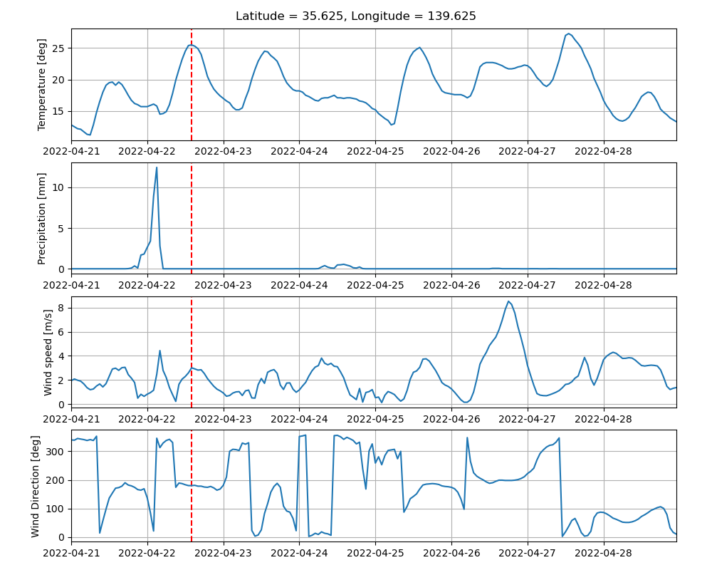

# 提出課題3

!!!note
    - 締め切りや提出方法・提出先については指示を出すのでそれに従ってください．
    - 少し難易度が高いかもしれないので全ての課題に取り組む必要はありません．できたところまでを提出してください．

## 課題3-1
物質の密度分布$f = f(x, t)$を表す以下の移流拡散方程式

$$
\frac{\partial f}{\partial t} +
U \frac{\partial f}{\partial x} =
D \frac{\partial^2 f}{\partial x^2}
$$

は$f(x, t)$の速度$U$での移流および拡散係数$D$での拡散を表す方程式であり，
多くの場面で登場する非常に重要な方程式である．
初期条件として$f(x, t=0) = \delta (x)$とし，この方程式を乱数を用いた
モンテカルロ法によって解くプログラムを作成せよ．
特に$U = 0.2$，$D = 1$の場合について$t = 1, 2, 3, 4$での数値解と
解析解（ヒストグラム）を同じプロット上に図示し，両者を比較できるようにすること．  

具体的には，ある時刻の$f(x, t)$を$N$個の粒子で近似するには，プログラム中で
各粒子の$x$座標を表す長さ$N$の配列を用意し，全ての$x$座標を0に初期化する．  
各粒子の位置$x_i (t) (i=1, 2, \ldots, N)$を時間ステップ$\tau$だけ
更新するには，乱数を用いて

$$
x_i (t + \tau) = x_i (t) + U \tau \pm \sqrt{2 D \tau}
$$

とすればよい．ここで符号$\pm$を各ステップごと，各粒子ごとにランダムに選ぶ．
すなわち，$[0, 1)$区間の一様乱数$r$を発生させ，$r < 0.5$の時には$+$，
それ以外では$-$を選べばよい．
このような確率的にランダムな運動をランダムウォークと呼ぶ．

!!!hint
    - 時間発展の結果を図示する際には粒子の分布から適当なビン幅でヒストグラムを作成し，それを$f(x)$と考えればよい．
    ただし規格化(即ち$\int_{-\infty}^{\infty} f(x) = 1$)に注意せよ．
    ヒストグラムの作成には `np.histogram()` を用いればよい．
    - 境界条件は陽に考えなくてよい．これは$x$の範囲は無限空間($-\infty < x < \infty$)で，
    $\lim_{x \rightarrow \pm \infty} f(x) = 0$なる境界条件を採用することに相当する．
    - ランダムウォークによる拡散現象の近似はあくまで試行回数が多い場合の極限（中心極限定理）で
    のみ成り立つ．すなわち，$\tau \ll 1$でなければ$t \sim O(1)$での解としては不適切である．
    - 解析解(Green関数)は以下で与えられる．

    $$
    f(x, t) = \frac{1}{2 \sqrt{\pi D t}}
        \exp \left( - \frac{(x - U t)^2}{4 D t} \right)
    $$


## 課題3-2
[Open-Meteo](https://open-meteo.com/en) というサイトでは，無料で天気予報データを
ダウンロードできるサービスを提供している．
決められた形式でHTTPSアクセスをするとデータがJSON形式でダウンロードされる仕組みである．

このサイトの東京の天気予報データにアクセスする
[URL](https://api.open-meteo.com/v1/forecast?latitude=35.6785&longitude=139.6823&hourly=temperature_2m,precipitation,windspeed_10m,winddirection_10m&windspeed_unit=ms&timezone=Asia%2FTokyo&past_days=1)
を使って，ダウンロードしたデータのプロットをファイルに保存するプログラムを作成せよ．
ただし，オプション無しで実行した場合には ```openmeteo.png``` というファイル名で，
```-o``` オプションでファイル名を指定した場合には，指定されたファイル名で保存するようにせよ．
例えば以下のようなプロットが得られればよい．

<figure markdown="span">
{ width="600px" }
<figcaption>Open-Meteo</figcaption>
</figure>

!!!hint
    - matplotlibでは時間が ```numpy.datetime64``` 形式の配列になっていれば，
    横軸は自動でこの例のようにフォーマットされる．
    - この例のURLでは温度，降水量，風速と風向きをプロットしているが，ダウンロード
    するデータは自分でカスタマイズすることができる．

## 課題3-3
Pythonは一般に速度が遅い言語に分類されるが，様々な方法で高速化が可能である．
ここでは差分法を例にとって実際に高速化をしてみよう．

3次元の波動方程式

$$
\frac{\partial^2 u}{\partial t^2} = c^2
\left(
\frac{\partial^2 u}{\partial x^2} +
\frac{\partial^2 u}{\partial y^2} +
\frac{\partial^2 u}{\partial z^2}
\right)
$$

は $v = \partial u / \partial t$ を用いて

$$
\begin{aligned}
\frac{\partial v}{\partial t} & = c^2
\left(
\frac{\partial^2 u}{\partial x^2} +
\frac{\partial^2 u}{\partial y^2} +
\frac{\partial^2 u}{\partial z^2}
\right)
\\
\frac{\partial u}{\partial t} & = v
\end{aligned}
$$

と書ける．この方程式を差分法を用いて1ステップ時間を更新する関数 `push_naive` を
素朴にPythonで実装すると以下のようになるだろう．  
これと同じ計算を行う高速化した関数として `push_optimized` を実装せよ．  
なお，ここでは $c = 1$として，境界条件（`set_boundary_condition_naive`）は
周期境界条件を用いている．境界条件の設定部分の高速化も忘れずにすること．

```python
def set_boundary_condition_naive(uv, lbx, ubx, lby, uby, lbz, ubz):
    for iy in range(lby, uby + 1):
        for iz in range(lbz, ubz + 1):
            uv[lbx - 1, iy, iz] = uv[ubx, iy, iz]
            uv[ubx + 1, iy, iz] = uv[lbx, iy, iz]
    for ix in range(lbx, ubx + 1):
        for iz in range(lbz, ubz + 1):
            uv[ix, lby - 1, iz] = uv[ix, uby, iz]
            uv[ix, uby + 1, iz] = uv[ix, lby, iz]
    for ix in range(lbx, ubx + 1):
        for iy in range(lby, uby + 1):
            uv[ix, iy, lbz - 1] = uv[ix, iy, ubz]
            uv[ix, iy, ubz + 1] = uv[ix, iy, lbz]


def push_naive(u, v, lbx, ubx, lby, uby, lbz, ubz, dt, dx, dy, dz):
    # vを更新
    for ix in range(lbx, ubx + 1):
        for iy in range(lby, uby + 1):
            for iz in range(lbz, ubz + 1):
                # fmt: off
                v[ix, iy, iz] += dt * (
                    + (u[ix + 1, iy, iz] - 2 * u[ix, iy, iz] + u[ix - 1, iy, iz]) / dx**2
                    + (u[ix, iy + 1, iz] - 2 * u[ix, iy, iz] + u[ix, iy - 1, iz]) / dy**2
                    + (u[ix, iy, iz + 1] - 2 * u[ix, iy, iz] + u[ix, iy, iz - 1]) / dz**2
                )
                # fmt: on

    # uを更新
    for ix in range(lbx, ubx + 1):
        for iy in range(lby, uby + 1):
            for iz in range(lbz, ubz + 1):
                u[ix, iy, iz] += v[ix, iy, iz] * dt

    # 境界条件の設定
    set_boundary_condition_naive(u, lbx, ubx, lby, uby, lbz, ubz)
```

`wave3d.py`（以下の「準備」参照） は `push_naive` を用いて波動方程式を解くプログラムを実装したもので，以下のように実行すると1行目に `push_naive` ， 2行目に `push_optimized` を50ステップ実行するのにかかった時間が出力される．ここでは `push_optimized` は内部で `push_naive` を呼ぶだけとなっているが，この関数を適宜修正すればよい．

```bash
$ python wave3d.py
Elapsed time (naive)           : 5.247e+00
Elapsed time (optimized)       : 5.898e+00
```

!!!hint
    - `wave3d.py` は [GitHub](https://github.com/amanotk/python-resume-sample/blob/main/report/wave3d.py) にアクセスして適宜ダウンロードしよう．

    codespaceを使っている場合は `python/sample` ディレクトリで（もしくは自身で `git clone` した場合はそのディレクトリで）以下のコマンドを実行すれば `report` ディレクトリが作成され，その中に `wave3d.py` がダウンロードされる．

    - NumPy配列の配列演算や，`numba` や `f2py` や `cython` などを使う方法が考えられる．
    複数の方法を試して速度を比較してみるのも面白い．


!!!info
    これはあくまでプログラミングの課題なので，数値計算スキームについては何も考えずに

    $$
    \begin{aligned}
    v^{n+1/2}_{i,j,k} &= v^{n-1/2}_{i,j,k} +
    c^2 \Delta t \times \\
    & \left(
    \frac{u^n_{i+1,j,k} - 2u^n_{i,j,k} + u^n_{i-1,j,k}}{\Delta x^2} +
    \frac{u^n_{i,j+1,k} - 2u^n_{i,j,k} + u^n_{i,j-1,k}}{\Delta y^2} +
    \frac{u^n_{i,j,k+1} - 2u^n_{i,j,k} + u^n_{i,j,k-1}}{\Delta z^2}
    \right) \\
    u^{n+1}_{i,j,k} &= u^n_{i,j,k} + \Delta t \, v^{n+1/2}_{i,j,k}
    \end{aligned}
    $$
    
    を使うことにしよう．ここで$i, j, k$はそれぞれ$x, y, z$方向の格子点のインデックス，$n$は時間方向のインデックスである．
